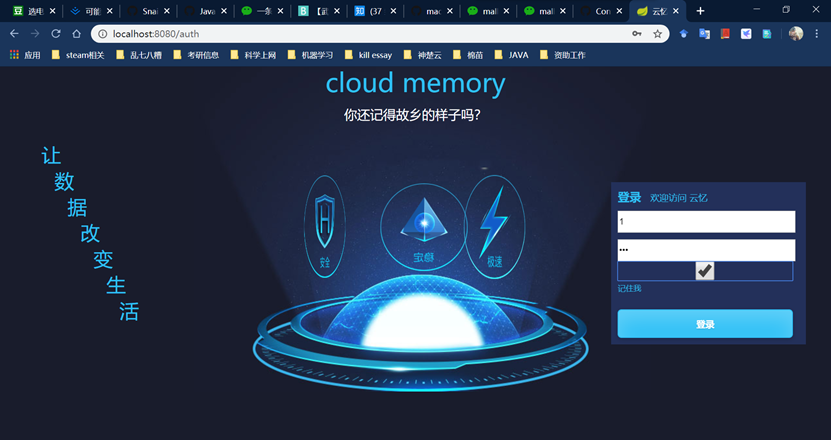
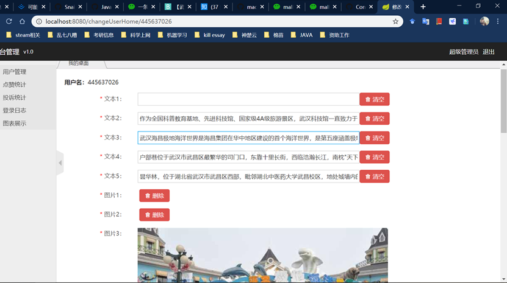
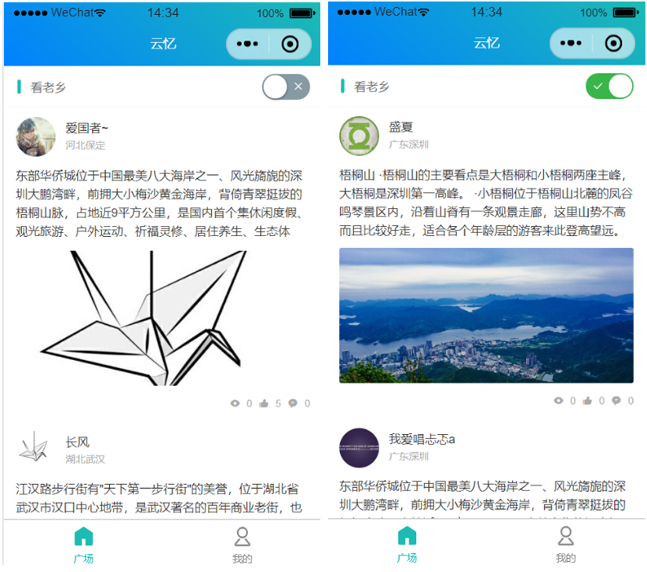

# yunYi

# 1 项目介绍

云忆，帮助用户分享家乡与寻找老乡

小程序端供普通用户使用，可以注册登录、编辑个人信息、寻找老乡、编辑个人主页，使用微信开发者工具完成，用到了ColorUI组件库/weapp。

- 个人信息维护：用户微信授权注册登录，修改个人相关信息
- 编辑个人主页：用户为个人主页添加图文、选择模板
- 浏览他人主页：用户通过点击进入他人主页，并进行点赞评论投诉相关操作
- 找老乡：用户寻找家乡和自己相同的用户

网页端供管理员使用，查看用户各项信息的统计情况，并对用户及其个人主页做出相关操作。使用IntelliJ IDEA完成，用到了Spring Boot/Thymeleaf/JPA/Spring Security。

- 登录系统：管理员通过用户名密码登录管理端
- 用户管理：管理员搜索、封禁和解封违规用户的帐号，并操作其个人主页
- 点赞统计：管理员查看每个用户的点赞信息
- 投诉统计：管理员查看被投诉用户的相关信息
- 登录日志：管理员查看所有管理员在管理端的登录日志
- 图表展示：管理员查看所有用户概览情况

# 2 项目结构

## 2.1、管理端后台

\yunyi\src\main\java\com\memory\yunyi
- controller 后台业务逻辑
- config 文件上传资源配置
- security Spring Security配置，实现过滤器等功能
- entity 业务实体类定义
- repository 数据访问层，定义数据库操作与SQL语句
- utils 附加组件，文件上传
- service 服务层定义
- serviceImpl 服务层实现
## 2.2、管理端页面

\yunyi\src\main\resources
- static 静态资源

  lib 相关js插件如echarts/jquery

- templates 动态网页

  login.html 登录，账户密码登录

  nav.html/shead.html 分离出来的导航栏/标题栏

  userList.html 用户列表

  changeUserHome.html 修改用户个人主页

  likesCount.html 点赞统计

  complainCount.html 投诉统计

  log.html 登录日志

  echarts.html 图表展示

- application.yml JPA/数据库/上传目录配置参数
## 2.3、小程序后台

\yunyi\src\main\java\com\memory\yunyi\wxController
- wxCommentController.java 控制评论的增加与显示
- wxLikeController.java 控制数据库点赞数量变化，老乡查询返回结果
- wxUpgController.java 获取用户主页内容，保存主页内容，设定模板号码
- wxUserController.java 获取用户列表，用户注册登录，更新用户个人信息
## 2.4、小程序页面与业务逻辑

\yunyi_wxApp
- imgs 小程序所需图片
- pages 小程序的各个子页面定义与业务逻辑实现
index 微信用户授权登录界面
list 查看所有用户以及老乡情况
mypage 更新个人信息以及进入个人主页门户
homepage 操作其他人主页，以及编辑自己主页
- app.js 获取微信用户信息，定义全局数据流转
- app.json 声明各个子页面，定义主界面样式
- app.wxss 定义全局具体样式，与子页面样式冲突时，以子页面为准
- project.config 项目配置文件

# 3 实现效果

## 3.1 管理端

登录界面

首页

用户列表/用户状态管理(封禁与解封)

更改用户主页

点赞统计

投诉统计

登录日志

图表展示

## 3.2 用户端

微信授权登录

查看所有用户/寻找老乡

更新个人信息(修改头像昵称)/跳转个人主页

编辑个人主页(上传图片文字并保存)

对他人主页进行浏览/点赞/投诉/评论操作

